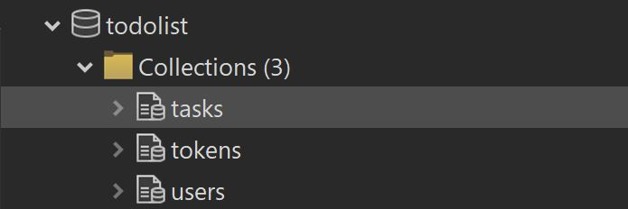

# To-Do App with JavaScript React Node.js/Express and MongoDB/Mongoose

## A fully functional To-Do App with regestration form so you can create your own account.

This is my first project where I incorporated my knowledge of **front-end** and **RESTful back-end** and connected them together.

### Check the demo version: https://todo-list-front-end-yxgf.onrender.com/

This fully functional To-Do App lets you:

-   **_on front-end:_**

    -   create your own account
    -   create, edit and delete your todos
    -   log-in/log-out

-   **_on back-end:_**

    -   link for the back-end code https://github.com/888yalo888/todo-rest-backapp
    -   create this user in the database (I used Studio 3T as a MongoDB GUI)
    -   create a token for security that is saved both in Session storage and in the database
    -   create, edits and deletes tasks from database
        
    -   provide log-in/log-out logic

## Installation

No installation needed because the app is hosted on free hosting website
https://render.com and the database is hosted on https://cloud.mongodb.com

## Running

### `npm start`

Runs the app in the development mode.\
Open [http://localhost:3000](http://localhost:3000) to view it in your browser.

The page will reload when you make changes.\
You may also see any lint errors in the console.

### `npm run build`

Builds the app for production to the `build` build.\
It correctly bundles React in production mode and optimizes the build for the best performance.

The build is minified and the filenames include the hashes.\
Your app is ready to be deployed!

See the section about [deployment](https://facebook.github.io/create-react-app/docs/deployment) for more information.
